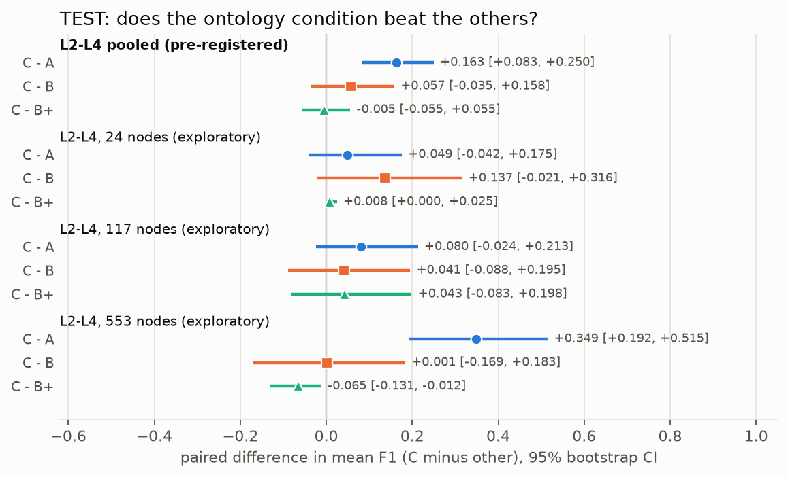
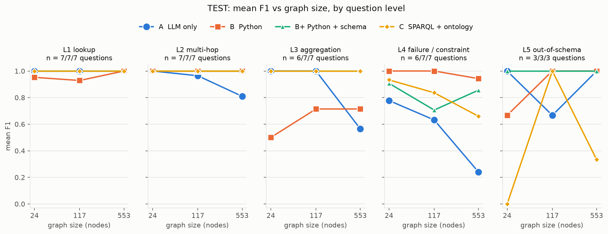

# Blast Radius: ontology-grounded vs LLM-only impact analysis

A small, pre-registered benchmark of the thesis:

> "LLMs grounded in an ontology are better at reasoning about system topology than LLMs alone."

## Result

**The pre-registered test does not support the thesis.** On the frozen TEST set, the ontology condition (C: SPARQL over an RDFS/OWL-described graph) and the schema-documented code condition (B+: Python over raw JSON, same schema documentation) are indistinguishable on topology questions:

| Pre-registered test (TEST, levels L2-L4, all sizes pooled, n = 61) | Mean F1 difference | 95% bootstrap CI | Decision |
|---|---|---|---|
| **C − B+** | **−0.005** | **[−0.055, +0.055]** | CI includes 0: **thesis not supported** |

The interval is narrow and centred on zero, so this reads as a tie rather than an underpowered test. Under the pre-registered decision rule (see [PREREG.md](PREREG.md)), the conclusion is **"schema knowledge + code helps; a formal ontology is not needed"** for these questions. Grounding of either kind clearly beats the LLM alone (C − A = +0.163 [+0.083, +0.250]), and that gap grows with graph size.



## Setup

One synthetic infrastructure graph per size (fixed seeds), the same questions, and the same model for every condition: Anthropic's Haiku 4.5 (2025-10-01 snapshot; model ID set in `llm.py`), temperature 0, `max_tokens` 8192.

| Condition | Model is given | Tools | Retries |
|---|---|---|---|
| **A** LLM only | the whole graph serialized in the prompt; no schema documentation | none | 0 |
| **B** Python | file name, JSON shape, 2 sample records per node type and relation | Python sandbox over the raw JSON | 1, on error only |
| **B+** Python + schema | B plus prose schema documentation | Python sandbox over the raw JSON | 1, on error only |
| **C** SPARQL + ontology | the same prose schema documentation plus `schema.ttl`; never the data | one SPARQL query, executed by rdflib | 1, on error only |

- **Graph.** Services (with a `CustomerFacingService` subclass and tier 1-3), databases, queues, teams, regions and SLAs; relations `dependsOn` (transitive), `ownedBy`, `deployedIn`, `hasSLA`, `replicaOf`. The graph is layered, has hub nodes with many dependents, and contains planted rule violations and replica edge cases. Sizes are labelled 20/100/500; the actual node counts (replicas included) are **24 / 117 / 553**.
- **Questions.** 131 generated questions with answers computed by NetworkX in `truth.py`, which is independent of rdflib and of every harness. Five levels: **L1** lookup, **L2** multi-hop, **L3** aggregation/negation, **L4** failure/constraint (region failure, SLA breach, tier-rule violations), **L5** out-of-schema (path lengths and path counts). Split DEV 40 / TEST 91. The thesis test uses L2-L4.
- **Scoring.** Set precision/recall/F1 (exact match for booleans and numbers), hallucinated-ID counts, and paired bootstrap CIs over questions (10,000 resamples, seed 0).
- **Retries.** Identical for B, B+ and C: retry once on an exception, timeout, parse failure or unmappable answer, never on a legitimately empty result.

## Results (TEST)

Everything below the pre-registered test is **exploratory**: it was specified as secondary in PREREG.md, it was not used for the decision, and the per-cell counts are small (3-7 questions per size × level).



**Mean F1, L2-L4, by graph size (exploratory)**

| Nodes | A | B | B+ | C |
|---|---|---|---|---|
| 24 | 0.930 | 0.842 | 0.971 | 0.979 |
| 117 | 0.865 | 0.905 | 0.902 | 0.945 |
| 553 | 0.538 | 0.886 | 0.952 | 0.887 |
| **pooled** | **0.773** | **0.879** | **0.941** | **0.936** |

**Mean F1 by level, all sizes (exploratory; L1 and L5 are outside the thesis test)**

| Level | A | B | B+ | C |
|---|---|---|---|---|
| L1 lookup | 1.000 | 0.960 | 1.000 | 1.000 |
| L2 multi-hop | 0.925 | 1.000 | 1.000 | 1.000 |
| L3 aggregation | 0.848 | 0.650 | 1.000 | 1.000 |
| L4 failure / constraint | 0.539 | 0.980 | 0.819 | 0.804 |
| L5 out-of-schema | 0.889 | 0.889 | 1.000 | 0.444 |

**Paired differences, 95% bootstrap CI (exploratory except the first row)**

| Subset | C − B+ | C − A | C − B |
|---|---|---|---|
| L2-L4 pooled (pre-registered) | −0.005 [−0.055, +0.055] | +0.163 [+0.083, +0.250] | +0.057 [−0.035, +0.158] |
| L2-L4, 24 nodes | +0.008 [+0.000, +0.025] | +0.049 [−0.042, +0.175] | +0.137 [−0.021, +0.316] |
| L2-L4, 117 nodes | +0.043 [−0.083, +0.198] | +0.080 [−0.024, +0.213] | +0.041 [−0.088, +0.195] |
| L2-L4, 553 nodes | −0.065 [−0.131, −0.012] | +0.349 [+0.192, +0.515] | +0.001 [−0.169, +0.183] |
| L3 | 0.000 | +0.152 [+0.016, +0.316] | +0.350 [+0.150, +0.550] |
| L4 | −0.015 [−0.169, +0.166] | +0.265 [+0.077, +0.468] | −0.176 [−0.304, −0.055] |
| L5 (excluded) | −0.556 [−0.889, −0.222] | −0.444 [−0.889, +0.000] | −0.444 [−0.778, −0.111] |

What the exploratory numbers suggest, to be treated as hypotheses rather than findings:

- **Scale hurts the LLM alone.** A falls from 0.93 to 0.54 on L2-L4 between 24 and 553 nodes; both of its unparsed answers are 553-node L4 questions.
- **The schema documentation does the work on L3.** Without it, B fails aggregation questions (0.65): it scores 0/5 on "how many services are deployed in R", over-counting (for example 29 for 19) because it cannot tell which node types are services. B+ and C both score 1.00.
- **The formal ontology adds nothing over documented code.** At 553 nodes B+ is slightly ahead of C (−0.065, CI just excluding zero), driven by C's L4 errors below.
- **L4 does not follow the schema-knowledge pattern.** Plain B (0.98) beats both B+ (0.82) and C (0.80) on failure and constraint questions; see the failure analysis.
- **L5 behaves as designed.** C (0.44) falls well short of the code conditions (0.89-1.00); path length and path counting are awkward in SPARQL property paths, although C solved some by unrolling fixed-length paths.

**Other metrics (TEST)**

| | A | B | B+ | C |
|---|---|---|---|---|
| Hallucinated IDs | 0 | 0 | 0 | 0 |
| Parsed answers | 97.8% | 100% | 100% | 98.9% |
| Retry rate | — | 3.3% | 0% | 6.6% |
| Timeouts (60 s) | 0 | 0 | 0 | 0 |
| Mean input / output tokens | 11,715 / 951 | 782 / 587 | 1,076 / 569 | 1,660 / 416 |
| Mean latency | 7.2 s | 4.8 s | 4.7 s | 3.6 s |
| TEST spend | $0.61 | $0.34 | $0.36 | $0.23 |

C produced valid SPARQL for 99% of questions (93% on the first try). The one invalid query was a syntax error on an L5 question that survived the retry. There were no timeouts, so the pre-registered timeout sensitivity check is identical to the primary result. Total API spend for the project, DEV and TEST: **$3.08**.

## Failure analysis: C's 9 wrong L4 answers

All 9 are **region-failure questions**: `region_down` 5, `region_sla` 3, `region_count_down` 1. That is 9 wrong out of the 12 region-failure questions that are not about survivors. Each query was valid and executed; retries did not apply. C answered every tier-rule question (`violations`, `transitive_violations`, 4/4) and every `region_survivors` question (4/4) correctly.

The hard part of these questions is a **universally quantified condition over a group defined by a property path**: "a node is lost if *every* member of its replica group is deployed in R". In SPARQL that needs a double negation, `FILTER NOT EXISTS { ?n (ex:replicaOf|^ex:replicaOf)* ?m . ?m ex:deployedIn ?r . FILTER(?r != R) }`. The model's queries fall into three patterns:

| Pattern | Questions | Effect | What the query did |
|---|---|---|---|
| **1. Member-level instead of group-level footprint** | 100-L4-03, 100-L4-07, 500-L4-03, 500-L4-06, 500-L4-09 | over-inclusive: recall 1.00, precision 0.38-0.62 | Bound one group member `?m` and tested that *that member* has no region other than R. Any group with at least one member in R passes, even when another member is in a surviving region. |
| **2. Footprint filter scoped outside the UNION** | 20-L4-06, 100-L4-09, 500-L4-04 | under-inclusive, often mixed with pattern 1: recall 0.43-0.53 | Applied "the service itself is lost" to every result, so the "depends on a lost node" branch only added services that were already lost. |
| **3. Lost dependencies restricted to services** | 500-L4-07 (count) | undercount: 54 vs 137 | Got the group-level filter right but only treated *services* as possible lost dependencies, dropping lost databases and queues. |

The ontology does not help here: it states what `replicaOf` and `deployedIn` mean, but writing "all members of a symmetric transitive group satisfy X" in SPARQL is still left to the model, and Haiku got it wrong on 9 of these 12 questions.

For comparison, on the same 12 region-failure questions plain **B scores 1.00** on every kind, while **B+ scores 0.75-0.88** per kind: mostly off-by-one over-counts (for example 17 for 16) plus two empty answers. So this is not simply "Python beats SPARQL": the condition without schema documentation did best, and the documented code condition also lost points. With 12 questions this is a hypothesis, not a finding. One reading is that the longer schema text adds replica and primary semantics that the model then applies inconsistently, while B works only from the definitions in the question.

## Limitations

- **Synthetic data.** One generator with fixed seeds, three graphs. Real infrastructure graphs are messier (partial data, inconsistent naming, multiple regions per service).
- **Circularity risk.** The generator, the question templates, the ground truth and the ontology were all written by the same author, so the ontology fits the questions by construction. Real ontologies rarely fit the questions this well, which if anything should favour C.
- **One model.** Haiku 4.5 only, one run at temperature 0, no variance across seeds or models. A stronger model may write the double-negation SPARQL reliably.
- **No reasoner enabled.** C ran plain SPARQL over asserted triples: subclass membership and transitivity were handled through property paths (`rdf:type/rdfs:subClassOf*`, `ex:dependsOn+`), not by an OWL/RDFS reasoner. A reasoner, or rules that materialise "lost" and "down", could change C's L4 results.
- **Ontology construction cost not measured.** Writing `schema.ttl` and converting the data to RDF took effort that the benchmark does not count; B+ only needed the prose documentation.
- **Best-effort sandbox.** The Python sandbox is a subprocess with a temp directory, a scrubbed environment, a timeout and in-process socket and subprocess blocking. It guards against accidents, not adversaries, and a program could still read files by absolute path.
- **Changes made during development.**
  - Generator, at step 1, before any question or model run existed: replication rates, region locality and replication of hub dependencies were tuned so that region-failure answers were not "every SLA". This is not in PROMPT_LOG.md.
  - After looking at DEV results, the following changed before freezing, all logged in [PROMPT_LOG.md](PROMPT_LOG.md):
  - questions: `region_down` / `region_count_down` were limited to primary services, and the "primary" clause was reworded to state the edge direction;
  - harness: `max_tokens` was raised from 4096 to 8192 for every condition, and C's parser now skips a code block that holds only the answer-type declaration.

  No condition-specific prompt was tuned (every condition stayed at prompt version 1).
- **Small per-cell counts.** 3-7 questions per size × level. Every per-size or per-level comparison is exploratory, and several intervals are wide.
- **Shared question wording across conditions.** Every condition received the same question text, including the definitions of replica group, footprint and "down". This keeps the comparison fair, but it also means the questions themselves carry part of the schema knowledge: B, with no schema documentation, still got the failure semantics from the question. In addition, 26 TEST questions (L3 15, L4 11) have identical text at every graph size. C's prompt does not depend on graph size, so for 24 of them C reused the same cached query and ran it against each graph. C's answers to those questions are therefore not independent across sizes, while A's, B's and B+'s are.
- **C cannot post-process.** The harness maps a SPARQL result directly to the answer; A, B and B+ can reshape their output freely.

## Reproduce

```
python -m venv .venv && .venv/Scripts/pip install -r requirements.txt   # Windows paths; use .venv/bin on Unix
python gen.py            # graphs (JSON + RDF) for all sizes; verifies JSON == RDF
python truth.py          # summary stats; checks every planted case is detected
python questions.py      # data/questions.json (no answers) + data/answers.json
python test_score.py     # scorer unit tests
python test_harness.py   # offline harness tests (no API calls)
export ANTHROPIC_API_KEY=...
python run_A.py --size all --split test     # likewise run_B.py, run_Bplus.py, run_C.py
python score.py test     # tables and the paired bootstrap
python plots.py          # results/f1_vs_size.png, results/ci_differences.png
```

Every LLM call is cached on disk in `cache/` (git-ignored), keyed by condition, model, prompt and `max_tokens`, so reruns are free. Raw responses for every question are kept in `results/*_{dev,test}.jsonl`.

## Files

| File | Purpose |
|---|---|
| `gen.py` | seeded graph generator; writes JSON, RDF and the planted-case manifest |
| `truth.py` | NetworkX ground truth; independent of rdflib and the harnesses |
| `questions.py` | question templates, DEV/TEST split, answer key |
| `llm.py` | the only module that calls the model; disk cache and prompt log |
| `common.py` | shared answer format, schema documentation and retry loop |
| `sandbox.py` | subprocess runner for Python (B, B+) and SPARQL (C) |
| `run_A.py`, `run_B.py`, `run_Bplus.py`, `run_C.py` | one harness per condition |
| `schema.ttl` | RDFS/OWL schema used by C |
| `score.py`, `plots.py` | scoring, bootstrap CIs, figures |
| `PREREG.md` | pre-registration, written and committed before the TEST run |
| `PROMPT_LOG.md` | every prompt, question and harness change, with the DEV evidence for it |
